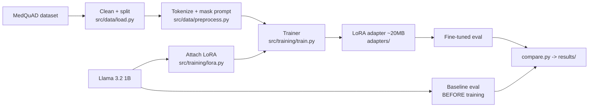

# LoRA Fine-Tuning: Llama 3.2 1B for Medical Q/A


A clean, **reproducible** LoRA (parameter-efficient) fine-tuning pipeline that adapts
**Llama 3.2 1B Instruct** to medical question-answering — with **honest before/after evaluation**
on a **free GPU**.

> ⚕️ **Disclaimer:** This is an **educational demonstration of fine-tuning**. Model outputs are
> **not medical advice**. Do not use for diagnosis or treatment. Consult a healthcare professional.

---

## Why this project

It demonstrates the full PEFT workflow end-to-end — not a toy notebook:
data preprocessing with **completion-only loss masking**, a justified **LoRA configuration**,
**T4-optimized training** (fp16 + gradient checkpointing + accumulation), and a **measured**
baseline-vs-fine-tuned comparison. Everything is config-driven and re-runnable from a fresh clone.

## Results

> Numbers are produced by the shipped scripts and are fully reproducible. Run the pipeline and
> `results/comparison.md` + the plots below are generated for you. A 1B model gives **modest but
> real** gains — this project does not overstate them.

| Metric | Baseline | Fine-tuned | Change |
|---|---|---|---|
| Eval loss | _run to fill_ | _run to fill_ | _run to fill_ |
| Perplexity | _run to fill_ | _run to fill_ | _run to fill_ |

Generated artifacts: `results/loss_curve.png`, `results/lr_schedule.png`,
`results/before_after.png`, `results/baseline_samples.md`, `results/finetuned_samples.md`.

## Architecture



## Repository layout

| Path | What |
|---|---|
| `configs/` | All tunables (model, LoRA, training, data) — no magic numbers in code |
| `src/data/` | Loading, the single-source-of-truth prompt template, tokenization/masking |
| `src/training/` | Model loading, LoRA setup, training loop, metrics callback |
| `src/evaluation/` | Perplexity, baseline capture, before/after comparison |
| `src/inference/` | Adapter load, merge, interactive + batch generation |
| `src/utils/` | Config dataclasses, seeding, logging, env check |
| `scripts/` | Thin CLIs: baseline → train → eval → plot → infer |
| `tests/` | Config/prompt unit tests + optional end-to-end smoke test |
| `docs/` | Feasibility, hyperparameter guide, interview prep, resume assets |
| `results/` | Committed proof: plots + before/after tables |

## Quickstart

**Prerequisites:** a GPU environment (Kaggle T4 recommended — see [`environment.md`](environment.md))
and, for Llama, an accepted [Meta license](https://huggingface.co/meta-llama/Llama-3.2-1B-Instruct)
+ `HF_TOKEN`. No access? Set `base_model_id: "Qwen/Qwen2.5-1.5B-Instruct"` in `configs/model.yaml`.

```bash
pip install -r requirements.txt
python -m src.utils.env_check          # verify GPU / CUDA / libraries / HF auth

python -m scripts.run_baseline         # 1. measure the base model BEFORE training
python -m scripts.run_train            # 2. LoRA fine-tune -> adapters/
python -m scripts.run_eval             # 3. measure fine-tuned + write results/comparison.md
python -m scripts.plot_results         # 4. generate figures into results/

python -m scripts.run_infer            # interactive chat with the fine-tuned model
python -m scripts.run_infer --batch questions.txt answers.jsonl   # batch
python -m scripts.run_infer --merge    # merge adapter into standalone model
```

Run order matters: **baseline before train** (so the comparison is real), **eval after train**.

## Configuration

Change behavior by editing YAML, not code. See [`docs/hyperparameters.md`](docs/hyperparameters.md)
for the reasoning behind every value.

- `configs/model.yaml` — base model, dtype, QLoRA 4-bit toggle
- `configs/lora.yaml` — r, alpha, dropout, target_modules
- `configs/train.yaml` — epochs, LR, batch, precision, early stopping
- `configs/data.yaml` — dataset, split ratios, max sequence length

**Low VRAM (<8GB)?** Set `use_4bit: true` in `configs/model.yaml` and
`optim: paged_adamw_8bit` in `configs/train.yaml` (QLoRA).
**Fast dry run?** Set `max_samples: 500` in `configs/data.yaml`.

## Reproducibility

Fixed seeds everywhere, deterministic data splits, pinned dependencies, config-driven runs,
and metrics logged to `logs/metrics.jsonl` so plots regenerate identically. Secrets are read
from environment variables only — **no tokens in the repo**.

## Testing

```bash
pytest tests/test_config.py tests/test_prompt.py -q   # no downloads
RUN_SMOKE=1 pytest tests/test_smoke.py -s              # tiny end-to-end (downloads a model)
```

## Limitations

A 1B model has a real capability ceiling — expect **modest** gains. MedQuAD answers are long and
get truncated, so the model learns **style + grounding** more than full articles. "Accuracy"
isn't well-defined for open-ended QA, so we report perplexity + ROUGE-L + qualitative samples and
say so. See [`docs/phase1_feasibility.md`](docs/phase1_feasibility.md).

## Future work

QLoRA on a larger base · DPO/preference tuning · GGUF/Ollama export of the merged model ·
RAG-vs-fine-tuning comparison · experiment tracking (Weights & Biases).

## Credits & licenses

- Code: MIT (see [`LICENSE`](LICENSE)).
- Base model: **Meta Llama 3.2** — subject to the Llama 3.2 Community License.
- Dataset: **MedQuAD** (`keivalya/MedQuad-MedicalQnADataset`), derived from NIH/NLM sources.

Model outputs are an educational demonstration and **not medical advice**.
